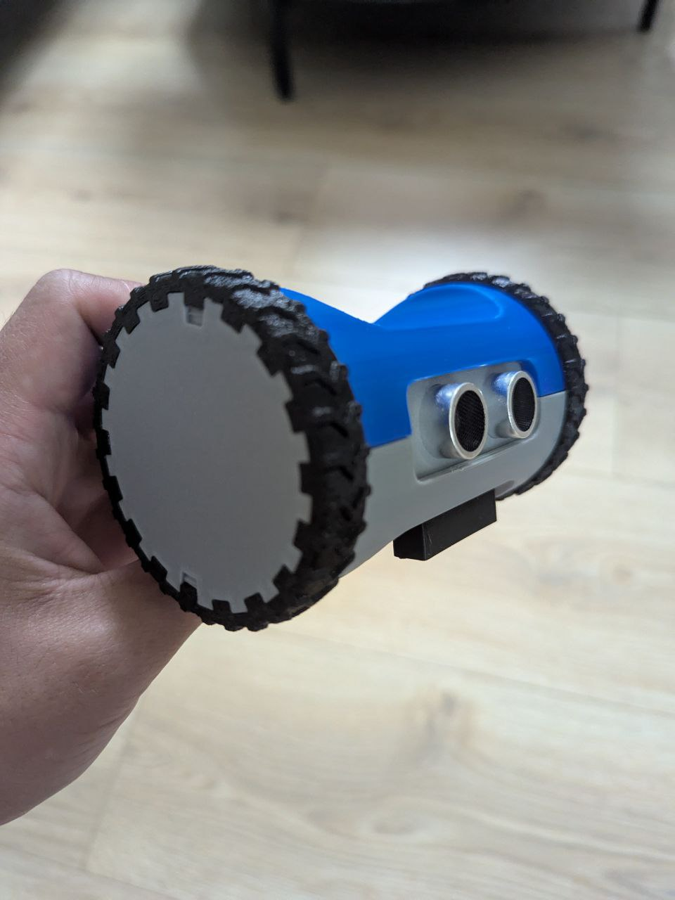

# [Tiny Robot Car](https://anarsoul.github.io/esp-zerobot-nostd)

This is a tiny robot car based on [Zerobot chassis]("https://hackaday.io/project/25092-zerobot-raspberry-pi-zero-fpv-robot/log/97988-the-new-zerobot-pro")

Strictly speaking, the only part from Zerobot is enclosure with some minor modifications.

Software and hardware are mine, although the hardware is rather trivial: esp32-c3-zero driving 2 DC motors with LM298N-like drivers,
TCS3472 color sensor and HC-SR04 ultrasonic sensor. It doesn't have a camera and doesn't support remote control (yet)

The firmware is written in Rust using esp-hal and embassy. It might look a bit overengineered, but hey - it runs on bare metal!

# Hardware

The robot enclosure and wheels were printed on a 3D printer.

The robot has ultrasonic sensor at its front. The robot uses it to measure the distance to a solid object in front of it. If anything blocking the view is closer than 5cm, the robot will stop and will not attempt to move.

At the bottom there is a color sensor with its shade. The shade reduces influence of ambient light. This sensor is the "eye" of the robot.
It is not a camera, all it can do is to tell the robot what color it "sees". It cannot recognize the shapes.

At the back there is ON/OFF switch and the charge port

# Manual

The robot is programmed using color mats. Currently it can recognize 4 colors:

- Purple
- Red
- Orange
- Blue

If the robot is not blocked, it will perform following actions based on the color it sees:

- Forward if it sees Purple
- Right if it sees Blue
- Left if it sees Orange or Red

Build the "program" for the robot with the mats, place the robot while it is off on the first mat, and then turn the robot on.

Example:

# FAQ

## The robot goes slightly sideways instead of going forward

Yeah, it is a known issue. The robot uses 2 motors for moving and unfortunately the motors might be built slightly differently. The robot does not have a way to sense its orientation or how many revolutions the wheels made. To compensate for the motors difference, I calibrated the power applied to the motors to get the same speed on each motor, but it is not an ideal solution. Better solution would require extra hardware, e.g. encoders so the software can sense position of the wheels or an accelerometer so the robot can sense the direction

TLDR: it is a classic problem and there is no good software-only solution
